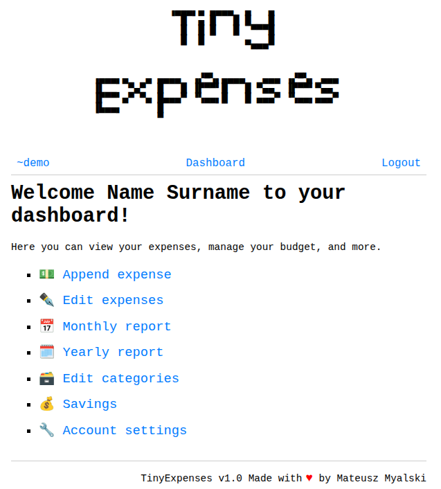

# TinyExpenses
TinyExpenses is a minimal, personal finance tracker built with Flask. It supports multi-user setups, tracks expenses and income by category, and exposes a simple API for automation.



## 🚀 Getting Started
1. Install Dependencies (inside root dir)

```bash
pip install -r .
```

2. Set Up Your App
Create a Python file `wsgi.py` with the following content (or modify according to your needs):
```bash
from tinyexpenses import create_app
app = create_app("tinyexpenses.config.ProductionHTTPSConfig")
```
Use Waitress and nginx for real production environment.

3. Set Environment Variables
Before running the app, set the required variables:
```bash
export SECRET_KEY="your-very-secret-key"
```
You can generate secret key with:
```bash
python -c 'import secrets; print(secrets.token_hex())'
```
__Changing the secret key invalidates all user API tokens.__

4. Run directly (local-only)
```bash
flask run
```

## 📁 Create the Accounts Directory
TinyExpenses stores user configurations inside a folder (default: `accounts/`). Create it manually or point to a custom path using `ACCOUNTS_DB_DIRECTORY_PATH` envariomental path.

```bash
mkdir accounts
```

## 👤 Creating Users with the CLI
TinyExpenses comes with a built-in CLI to manage users.

```bash
python -m tinyexpenses.cli init-user accounts
```

You will be prompted to enter:

- Username
- Full name
- Password (with confirmation)

Example output:

```bash
✅ User 'alice' initialized at accounts/alice/config.toml
```

Reset a User’s Password
```bash
python -m tinyexpenses.cli reset-password accounts alice
```
Prompts for a new password with confirmation.

## 🧠 How It Works
Each user has a separate folder under `accounts/`, storing their config and data.

Yearly balances are updated automatically based on categories (Income or Expense).

You can add compensation/adjustments using negative amounts (e.g., -50.0).

## ✅ API (Optional Use)
You can automate expense tracking by sending JSON requests with your user’s API token.

```http
PUT /api/v1/<username>/expenses/append
X-API-Key: your-api-key
Content-type: application/json

{
  "amount": 14.99,
  "title": "Dinner",
  "category": "Food",
  "date": "2025-08-02"
}
```

```http
GET /api/v1/{{ username }}/expenses/view/balance HTTP/1.1
X-API-Key: (Here put your X-API key)
```